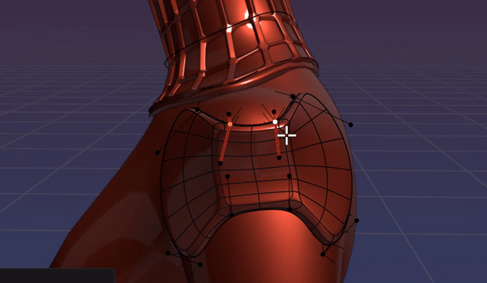
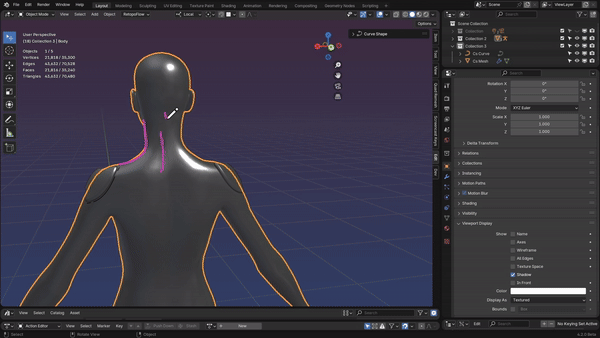

# Curve Shapes
### Create Geometry with Bezier Curves

***Curve Shapes*** is a Blender extension that allows you to manipulate geometry with curves. 

Create clean topology using Bezier and Poly curves. 

Use your curves to control the generated mesh in real time. 

***

Curve Shapes offers several ways to create geometry from curves including 
* Curve shape from Blender curve
* Curve shape from Annotations
* And existing curve shape templates

### In blender, a Curve Shape is composed of 2 objects: 
* A curve object 
* A mesh object

The curve object is used to control the shape of the mesh object. 

This allows you to create complex shapes with ease using bezier curves.

***

### [Bug reports ](https://github.com/MadPonyInteractive/CurveShapes/issues) | [Suggestions](https://github.com/MadPonyInteractive/CurveShapes/discussions)

### Purchase @ [Blender Market](https://www.blendermarket.com/products/curve-shapes) | [Gumroad](https://mad-pony-interactive.gumroad.com/l/zttlm)
