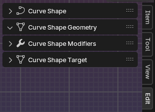

# Adding Curve Shapes
## Method 1: Using the add menu
You can use a pre-made template by adding a curve shape from the add menu.

1. Click on the add menu or press Shift+A to display it.
2. Got to the Curve submenu and look for the curve shape templates.

Current templates available are:
- Plane

## Method 2: Using Annotations
When annotations are drawn on the viewport, calling the 'Curve Shapes Pie Menu' will allow you to create curve shapes from the annotations.

1. Draw annotations on the viewport.
2. Call the 'Curve Shapes Pie Menu' by pressing the ` key.
3. Select the 'Annotations to Curve Shapes' option.

## Method 3: Selecting an existing curve object
When you have a curve object selected, calling the 'Curve Shapes Pie Menu' will allow you to create a curve shape mesh controlled by the selected curve object.

***

# Editing Curve Shapes
Selecting a curve or mesh object will display the Curve Shape panels.

With a curve or mesh object selected, go to the Edit tab in the N-panel to access the different Curve Shapes panels.

*! To view the N-panel press N*

The [Curve Shape Panel](5-panel-cs.md), is where you can setup the link between the mesh and the curve object.