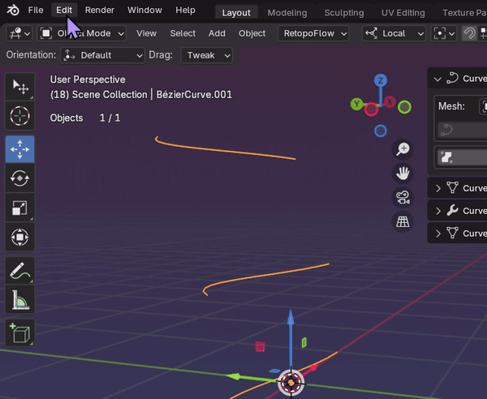

# Getting Started

## What are Curve Shapes?
In blender Curve Shapes are composed of 2 objects: a curve object and a mesh object. The curve object is used to control the shape of the mesh object. This allows you to create complex shapes with ease and precision using bezier curves.

## Pie Menu
Curve Shapes comes with a contextual pie menu that displays different options depending on what type of objects are selected, mode you are in and if you have annotations on screen. 

***To call the pie menu, press the ` key***

#### ! Changing the Pie Menu Shortcut Key
To change the pie menu shortcut key, go to Preferences > Keymap and write `curve shapes` in the search bar. You can then change the shortcut key to your preference.

## Adding Curve Shapes
### Method 1: Using the add menu
You can use a pre-made template by adding a curve shape from the add menu.

1. Click on the add menu or press Shift+A to display it.
2. Got to the Curve submenu and look for the curve shape templates.

Current templates available are:
- Plane

### Method 2: Using Annotations
When annotations are drawn on the viewport, calling the 'Curve Shapes Pie Menu' will allow you to create curve shapes from the annotations.

1. Draw annotations on the viewport.
2. Call the 'Curve Shapes Pie Menu' by pressing the ` key.
3. Select the 'Annotations to Curve Shapes' option.

### Method 3: Selecting an existing curve object
When you have a curve object selected, calling the 'Curve Shapes Pie Menu' will allow you to create a curve shape mesh controlled by the selected curve object.

## Editing Curve Shapes
Selecting a curve or mesh object will display the Curve Shape panels.

With a curve or mesh object selected, go to the Edit tab in the N-panel to access the different Curve Shapes panels.

### Panel: Curve Shape
Curve Shape is the first panel. Here you can define winch curve object will control winch mesh object.

#### When a mesh object is selected
The panel will display the curve object that is controlling the mesh object (if any). You can change the control curve object by selecting a different curve object from the dropdown list or by dragging and dropping the eyedropper icon on a curve object.

#### When a curve object is selected
The panel will display the mesh object that is being controlled by the curve object (if any). You can change the mesh object by selecting a different mesh object from the dropdown list or by dragging and dropping the eyedropper icon on a mesh object.

*! Keep in mind that a controlled mesh object will be re-created when changing the control curve object.*

The `Edit Curve` button will take you to the curve object's edit mode.

The `Create Surface` button will create a brand new mesh object from the selected curve object.

When a mesh object is associated with a curve object, the `Create Surface` button will change to `Update Surface`. This button will update the mesh object with the latest changes made to the curve object.

#### Edit Curve Mode
When the `Edit Curve` button is pressed, the curve object will be selected and the user will be taken to the curve object's edit mode.

In this mode, you will have one more button available: `Auto Update Mesh`. This button will enable the automatic update of the mesh object while editing splines. 

*This feature is still experimental and will get laggy when using a lot of splines and geometry.*

### Panel: Curve Shape Geometry
This panel is where you can define the initial geometry of the mesh object.

This panel is contextual, meaning it will give you different options depending on the amount of splines you have in your curve object.

#### Edges Box
The edges box will present you with options to define the amount of edges the mesh object will have as well as how they will behave.

**A single spline will have the following options:**
- `Edges`: The amount of edges the mesh object will have.
- `Snap`: The edges will snap to the points in the splines.
- `Even`: The edges will be evenly distributed along the spline.
- Close Type: The type of closing the mesh object will have.
    - `Open`: Only edges will be created.
    - `Ngon`: A single face will be created.
    - `Tris`: Triangles will be created to close the mesh object.
    - `Tri Fan`: A triangle fan will be created to close the mesh object.

**2 splines will have the following options:**
- `Spline Edges`: The amount of edges each spline will have.
- `Snap`: The edges will snap to the points in the splines.
- `Even`: The edges will be evenly distributed along the spline.
- `Connection Edges`: The amount of edges that will connect the splines.

**3 or more splines will have the following options:**
- `Spline Edges`: The amount of edges each spline will have.
- `Snap`: The edges will snap to the points in the splines.
- `Even`: The edges will be evenly distributed along the spline.
- `Closed`: This will add an edge loop connecting the first and last spline.
- `Connect Closest`: By default the edges will connect the splines in order of spline creation. This option will connect the splines based on proximity.
- `Connection Edges`: The amount of edges that will connect the splines.

#### Interpolation Box
When using 3 or more splines, the interpolation box will be available. This box will allow you to define how the bridged edges will be interpolated.

This is ...

#### Mesh Box

