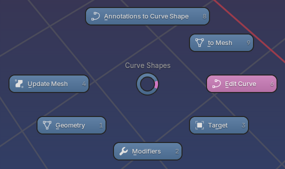

# Pie Menu
Curve Shapes comes with a contextual pie menu that displays different options depending on what type of objects are selected, mode you are in and if you have annotations on screen. 



***To call the pie menu, use: ``` Ctrl + Shift + ` ```***

## Changing the Pie Menu Shortcut Key
To change the pie menu shortcut key, go to Preferences > Keymap and write `curve shapes` in the search bar. You can then change the shortcut key to your preference.

