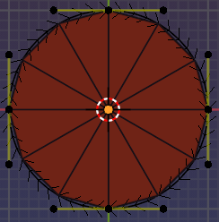

# Adding Curve Shapes
## Method 1: Using the add menu
You can use a pre-made template by adding a curve shape from the add menu.
| These should help you understand how to create your own curve shapes. 

1. Click on the add menu or press Shift+A to display it.
2. Got to the Curve submenu and look for the curve shape templates.

### Current templates available are:
#### Cs Circle


A circular shape created from 1 Bezier cyclic spline
#### Cs Ring


A ring shape created from 2 Bezier cyclic splines
#### Cs Plane


A plane created from 2 Polyline splines
#### Cs Surface


A surface created from 2 Bezier splines
#### Cs Loop


A circular shape created from 4 Bezier splines


## Method 2: Using Annotations
When annotations are drawn on the viewport, calling the 'Curve Shapes' Pie Menu, will allow you to create curve shapes from the annotations.


1. Draw annotations on the viewport.
2. Call the 'Curve Shapes' Pie Menu by pressing ``` Ctrl + Shift + ` ```
3. Select the 'Annotations to Curve Shape' option.

## Method 3: Selecting an existing curve object
When you have a curve object selected, calling the 'Curve Shapes Pie Menu' will allow you to create a curve shape mesh controlled by the selected curve object.

***

# Editing Curve Shapes
Selecting a curve or mesh object will display the Curve Shape panels.

With a curve or mesh object selected, go to the Edit tab in the N-panel to access the different Curve Shapes panels.


*! To view the N-panel press N*

#### ***Most of these panels are also accessible via the pie menu!***


#### ***And via the context menu!***


The first Panel, [Curve Shape](5-panel-cs.md), is where you can setup the link between the mesh and the curve object. This is usually not needed as it gets setup automatically in most cases but can be useful when you want to unlink the mesh from the curve object.