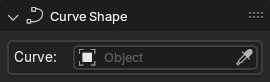
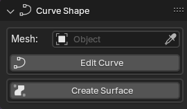
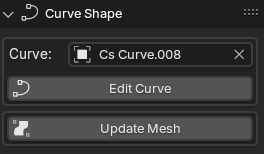
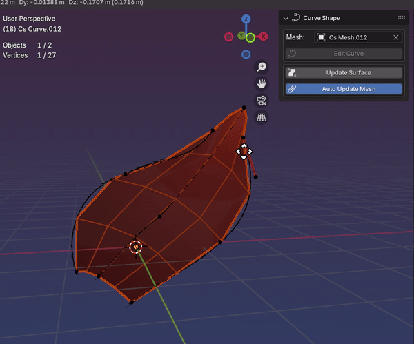
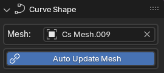

# Panel: Curve Shape
Curve Shape is the first panel. Here you can define winch curve object will control winch mesh object.

## When a mesh object is selected
The panel will display the curve object that is controlling the mesh object (if any).

You can change the control curve object by selecting a different curve object from the dropdown list or by dragging and dropping the eyedropper icon on a curve object.

## When a curve object is selected
The panel will display the mesh object that is being controlled by the curve object (if any). 

You can change the mesh object by selecting a different mesh object from the dropdown list when you press the `Mesh:` field or by clicking the eyedropper icon and then clicking on a mesh object.

*! Keep in mind that a controlled mesh will be re-created when changing the control curve object. Elements like Shape keys and Vertex Groups will be lost!*

***

The `Edit Curve` button will take you to the curve object's edit mode.

The `Create Surface` button will create a brand new mesh object from the selected curve object.

When a mesh object is associated with a curve object, the `Create Surface` button will change to `Update Surface`. 

This button will update the mesh object with the latest changes made to the curve object.

***

When the `Edit Curve` button is pressed, the curve object will be selected and the you will be taken to the curve object's edit mode.

In this mode, you will have one more button available: `Auto Update Mesh`. This button will enable the automatic update of the mesh object while editing splines. 

*! This feature is still experimental and will get laggy when using a lot of splines and/or edges.*
