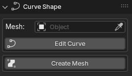

# Panel: Curve Shape
Curve Shape is the first panel. Here you can define winch curve object will control winch mesh object.
Most of the time you wont need to use this panel, as you can access the same options from the pie menu.

The only time you will need to use this panel is when you want to change the control curve object or the controlled mesh object.

## When a mesh object is selected
The panel will display the curve object that is controlling the mesh object (if any).

You can change the control curve object by selecting a different curve object from the dropdown list or by dragging and dropping the eyedropper icon on a curve object.

## When a curve object is selected
The panel will display the mesh object that is being controlled by the curve object (if any). 

You can change the mesh object by selecting a different mesh object from the dropdown list when you press the `Mesh:` field or by clicking the eyedropper icon and then clicking on a mesh object.

*! Keep in mind that a controlled mesh will be re-created when changing the control curve object. Elements like Shape keys and Vertex Groups will be lost!*

***

The `Edit Curve` button will take you to the curve object's edit mode and a operator properties box will appear allowing you to choose if you should use the `Auto Update Mesh` functionality.

#### This can also be done by using the `Edit Curve` option in the pie menu or the context menu.

In this mode, you will have one more button available: `Auto Update Mesh`. This button will enable the automatic update of the mesh object while editing splines. 

*! This feature is still experimental and will get laggy when using a lot of splines and/or edges.*

***

The `Create Mesh` button will create a brand new mesh object from the selected curve object.

#### This can also be done by using the `Create Mesh` option in the pie menu.

When a mesh object is associated with a curve object, the `Create Mesh` button will change to `Update Mesh`. 

This button will update the mesh object with the latest changes made to the curve object.

