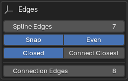
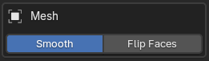

# Panel: Curve Shape Geometry
This panel is where you can define the initial geometry of the mesh object.


```
In this initial release V.3.0, only surface geometry is available. 
Future versions will include more types of geometry as well as 
options to close generated geometry.
```


This panel is contextual, meaning it will give you different options depending on the amount of splines you have in your curve object.

## Edges Box
The edges box will present you with options to define the amount of edges the mesh object will have as well as how they will behave.


### 1 spline


In this scenario the edges box will have the following options:


- `Edges`: The amount of edges the mesh object will have.
- `Snap`: The edges will snap to the points in the splines.
- `Even`: The edges will be evenly distributed along the spline.
- Close Type: The type of geometry used to create the mesh.
    - `Open`: Only edges will be created.
    - `Ngon`: A single face will be created.
    - `Tris`: Triangles will be created to create the mesh object.
    - `Tri Fan`: A triangle fan will be created to create the mesh object.


### 2 splines


In this scenario the edges box will have the following options:


- `Spline Edges`: The amount of edges each spline will have.
- `Snap`: The edges will snap to the points in the splines.
- `Even`: The edges will be evenly distributed along the spline.
- `Connection Edges`: The amount of edges that will connect the splines.

### 3 or more splines


In this scenario the edges box will have the following options:



- `Spline Edges`: The amount of edges each spline will have.
- `Snap`: The edges will snap to the points in the splines.
- `Even`: The edges will be evenly distributed along the spline.
- `Closed`: This will add an edge loop connecting the first and last spline.
- `Connect Closest`: By default the edges will connect the splines in order of spline creation. This option will connect the splines based on proximity.
- `Connection Edges`: The amount of edge loops between each spline edge connection.


## Interpolation Box
When using 3 or more splines, the interpolation box will be available. This box will allow you to define how the edges that connect the splines will be interpolated.


- `Regular`: This will change the interpolation algorithm, allowing for different results.
- `X | Y | Z`: This will allow you to block interpolation from happening in the selected axis.
- `Influence`: This controls the amount of interpolation applied. 

## Mesh Box



- `Smooth`: This will smooth the resulting mesh.
- `Flip Faces`: This will flip the faces of the mesh.

