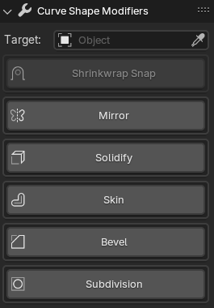

# Panel: Curve Shape Modifiers
This panel is where you can define the modifiers that will be applied to the mesh object.

These modifiers will be applied in the order they are listed in the panel. They come with the most appropriate properties for our extension. 

They are available in the mesh modifiers, in fact they are directly linked to the mesh modifiers, so changing the values in the panel will change the values in the mesh modifiers and vice versa.

They also save the change you make to their values, so if you remove a modifier and add it again, it will have the same values you set before.

Pressing one of the buttons will create and add the modifier to the mesh object.

*The main reason for this panel is to give you a way to change the modifiers as you edit the curve object.*

Some of the modifiers have extra options not available in the default Blender modifiers.

- **Target**: This field is directly correlated to the target field in the [Curve Shape Target](8-panel-target.md) Panel.