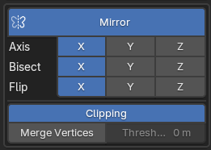

# Panel: Curve Shape Modifiers
This panel is where you can define the modifiers that will be applied to the mesh object controlled by the curve splines.

#### These modifiers will be applied in the order they are listed in the panel. 
When adding custom modifiers, make sure to add them at the end of the stack or simply ignore these modifiers and create your own. 
These modifiers will always have the `Cs` prefix in their name.

These modifiers are directly linked to the mesh modifiers, so changing the values in the panel will change the values in the mesh modifiers and vice versa.

They also save the change you make to their values, so if you remove a modifier and add it again, it will have the same values you set before.

Pressing one of the buttons will create and add the modifier to the mesh object.


Some of the modifiers have extra options not available in the default Blender modifiers.

- **Target**: This field is directly correlated to the target field in the [Curve Shape Target](8-panel-target.md) Panel.


## Shrinkwrap Snap
This modifier is useful for snapping all the genereated vertices to the target object. It will not be available if the target object is not set.


You can use the `Offset` field to define the distance between the generated vertices and the target object.

## Mirror
A mirror modifier is always useful and the most common options are available in this modifier panel.


## Solidify
The solidify modifier can be very useful as we are creating open meshes.


Activating this modifier will add options to the Bevel and Subdivision modifiers.

## Skin
The skin modifier is a very powerful modifier that will turn all generated edges into tube like structures. This can be useful for many different purposes.


Notice that we have 2 spliders that are not blender default.
The `Spline Multiplier` and the `Mesh Multiplier` are used to define the thickness of the generated tubes.

### Spline Multiplier
This value will define the thickness of the tubes based on the spline start and end point radius and will only affect the edges that are on top of the splines.

### Mesh Multiplier
This value will determine how much the remaining edges will be affected by the radius of the spline start and end points.

## Bevel
Bevel will be initially added using angle to determine the edges that will be beveled.


Notice we have a `Weights` button!

Pressing this button will display 2 sliders that will allow you to define the bevel weight for the generated boundary edges ***(not available on closed geometry)*** and for the edges on top of the splines.

```tip 
Only available for Blender 4.0 and over -> (Boundary and Splines sliders)
```


## Subdivision
The subdivision modifier is the cherry on top of the cake. It will smooth the mesh and make it look more organic. It does this by adding more geometry to the mesh.


Notice we have extra sliders at the end of the panel.

### Boundary
This slider will determine the crease amount for the generated boundary edges.

### Splines
This slider will determine the crease amount for the edges on top of the splines.
```tip 
Only available for Blender 4.0 and over -> (Boundary and Splines sliders)
```

### Inner Crease | Outer Crease | Rim Crease
These sliders come from the solidify modifier. When not using the solidify modifier, these sliders will not display.