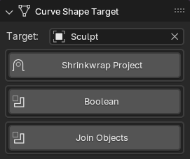

# Panel: Curve Shape Target
When joining your Curve Shape to a mesh object, you have different options to choose from. 

- `Target`: The target object that the curve shape will be joined to.
***This field is filled automatically when a curve shape is created from annotations and you have a mesh object selected.***

- `Shrinkwrap Project`: Useful for projecting the curve shape onto a mesh with a Multires modifier. 

- `Boolean`: Useful for creating a boolean operation between the curve shape and the target mesh.

- `Join`: Useful for joining the curve shape to the target mesh.

### Usage
You can only use one join method at a time.

* When using 'Shrinkwrap Project', 'Boolean' will be grayed out.
* When using 'Boolean', 'Shrinkwrap Project' will be grayed out.

Pressing Join or calling it from the pie menu will join the curve shape to the target object using the selected method.

If no method is selected a simple Join operation will be performed.

***The 'Join' button will be grayed out if the target object is using a Multires modifier and both 'Shrinkwrap Project' and 'Boolean' are not selected.***